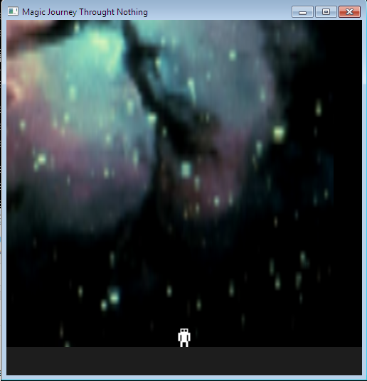

# Magic Journey Through Nothing

A dodge-the-falling-objects game built with C and OpenGL (FreeGLUT + SOIL).



## Setup from Scratch

### macOS (Homebrew)

```bash
# 1. Install Homebrew (if you don't have it)
/bin/bash -c "$(curl -fsSL https://raw.githubusercontent.com/Homebrew/install/HEAD/install.sh)"

# 2. Install dependencies
brew install gcc glew freeglut pkg-config

# 3. Build and install SOIL (not available via Homebrew)
cd /tmp
git clone https://github.com/littlstar/soil.git
cd soil
./configure && make
cp build/lib/libSOIL.a "$(brew --prefix)/lib/"
cp build/lib/libSOIL.0.1.dylib "$(brew --prefix)/lib/"
ln -sf libSOIL.0.1.dylib "$(brew --prefix)/lib/libSOIL.dylib"
mkdir -p "$(brew --prefix)/include/SOIL"
cp build/include/SOIL/*.h "$(brew --prefix)/include/SOIL/"
cd -

# 4. Clone and build the game
git clone https://github.com/afa7789/refactor_first_game.git
cd refactor_first_game
make all
make run
```

### Ubuntu / Debian

```bash
# 1. Install dependencies
sudo apt update
sudo apt install gcc make libglew-dev freeglut3-dev libsoil-dev

# 2. Clone and build
git clone https://github.com/afa7789/refactor_first_game.git
cd refactor_first_game
make all
make run
```

### Windows (MinGW)

```bash
# 1. Install MSYS2 from https://www.msys2.org/
# 2. In MSYS2 terminal:
pacman -S mingw-w64-x86_64-gcc mingw-w64-x86_64-glew mingw-w64-x86_64-freeglut make

# 3. Install SOIL manually:
#    Download from https://github.com/littlstar/soil
#    Build with: ./configure && make
#    Copy libSOIL.a to your MinGW lib directory
#    Copy SOIL/*.h to your MinGW include directory

# 4. Clone and build
git clone https://github.com/afa7789/refactor_first_game.git
cd refactor_first_game
make all
make run
```

## Make Targets

| Command | Description |
|---------|-------------|
| `make all` | Compile the game |
| `make run` | Compile and run |
| `make test` | Run unit tests (25 tests) |
| `make lint` | Static analysis (requires `cppcheck`) |
| `make clean` | Remove build artifacts |

## Controls

| Key | Action |
|-----|--------|
| `A` / `D` | Move left / right |
| `P` | Pause / Unpause |
| `R` (press twice) | Restart game |
| `S` | Increase difficulty (more falling objects) |
| `ESC` | Quit |

## How to Play

Dodge the falling objects. You have 3 lives. Survive until the progress bar fills to win.

## Project Structure

```
├── Makefile              # Build system
├── include/              # Headers
│   ├── config.h          # Game constants
│   ├── types.h           # Point, Size types
│   ├── game.h            # Game state and lifecycle
│   ├── physics.h         # Movement, collision, spawning
│   ├── input.h           # Keyboard handling
│   └── renderer.h        # OpenGL rendering
├── src/                  # Source
│   ├── main.c            # Entry point, GLUT setup
│   ├── game.c            # State management
│   ├── physics.c         # Physics (no GL dependency)
│   ├── input.c           # Input handling
│   └── renderer.c        # All OpenGL drawing
├── assets/               # Textures (PNG)
├── tests/                # Unit tests (Unity framework)
│   ├── test_game.c       # 16 game state tests
│   └── test_physics.c    # 9 collision/movement tests
└── vendor/unity/         # Unity C test framework
```

## Updated screenshot:


